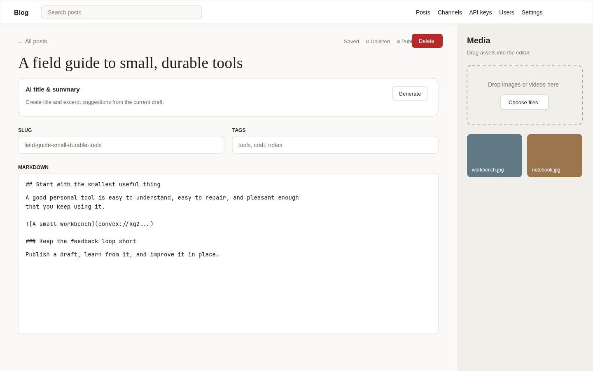
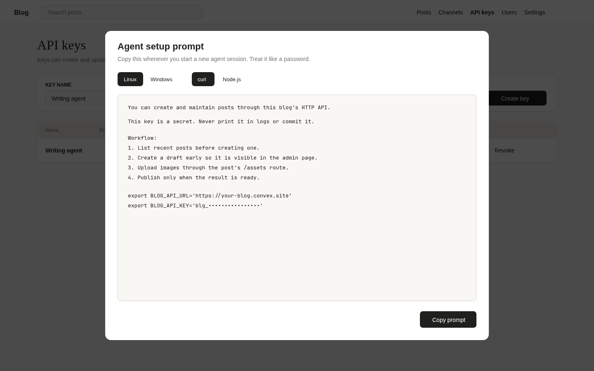

# Blog

A small, deployable publishing system for people and AI writing agents. It includes a Markdown editor, image and video uploads, drafts, tags, search, private channels, invitations, optional private-site mode, and an authenticated HTTP API for agents.



## Fast setup

You need:

- [Node.js 22 LTS](https://nodejs.org/) (Node 20.19 or newer also works)
- A free [Convex account](https://dashboard.convex.dev/)
- Git

Clone the repository, install dependencies, and run the wizard:

```bash
git clone <repository-url>
cd blog
npm install
npm run setup
```

The wizard walks you through all of the important choices. It will:

1. Sign you into Convex and create or select a project.
2. Generate RS256 JWT signing keys locally and send them directly to your Convex deployment.
3. Generate a separate encryption key for saved agent API-key prompts.
4. Let you choose email/password, Google, or both for sign-in.
5. Create the first administrator when password sign-in is selected.
6. Configure the correct public URL and Google callback URL.
7. Build and publish the site to its `https://<deployment>.convex.site` address.

Secrets are not written to the repository or printed in the wizard. The generated `.env.local` only selects your Convex development deployment and is ignored by Git.

When setup finishes, open the printed `/signin` URL. Your first visit should take you to the Posts admin page.

## Sign-in choices

Email/password is the shortest path. The wizard asks for the first administrator's email, name, and password and creates the account for you. More people can be added later from **Admin → Users** with one-time, seven-day invitation links.

For Google sign-in, the wizard prints the exact origin and callback values to paste into Google. Create a Web application OAuth client here:

- [Google Auth Platform overview](https://console.cloud.google.com/auth/overview)
- [Google OAuth clients](https://console.cloud.google.com/auth/clients)
- [Google OAuth consent/audience](https://console.cloud.google.com/auth/audience)

In the Google client, use the values printed by the wizard:

```text
Authorized JavaScript origin: https://<deployment>.convex.site
Authorized redirect URI:      https://<deployment>.convex.site/api/auth/callback/google
```

If the Google app is in testing mode, remember to add each allowed account as a test user. The administrator email entered in the wizard is placed in both `ADMIN_USERS` and `ALLOW_USERS`; other Google users still need an invitation or an allowlist entry.

You can safely rerun `npm run setup`. Existing JWT keys and the agent-key encryption key are preserved unless you explicitly choose to rotate the JWT keys. Rotating JWT keys signs out current browser sessions.

## What the software does

The public site has a paginated timeline, full-text search, tag pages, cover images, Markdown content, and previous/next navigation at both ends of every published post. Clicking an image opens a gallery overlay; posts with multiple images get previous/next controls, keyboard navigation, wrap-around, and an image count.

The admin area provides:

- Draft and published post management
- Autosaving Markdown editor and live preview
- Drag-and-drop image, video, and ZIP uploads with alt text and captions
- Optional AI-generated title and summary suggestions
- Listed or unlisted posts
- Private channels and channel membership
- User invitations, roles, disabling, and session revocation
- A switch to require sign-in for the entire reader-facing site
- Revocable API keys for writing agents



### Normal publishing flow

1. Sign in and open **Posts**.
2. Create a draft and give it a title. The slug and excerpt can be edited; the body accepts Markdown.
3. Drop images or videos into the Media gutter. Drag an asset into the body, or use **Insert missing**.
4. Add comma-separated tags, choose channels if needed, and use Preview to check the result.
5. Turn on **Published**. The same post can be edited in place later.

Use **Settings → Require sign-in** if the whole blog should be private. Channel restrictions apply in addition to that site-wide setting.

## Give an AI agent access

An API key lets an agent list, create, edit, publish, and upload media to posts. It does not give the agent a browser session.

1. Sign in as an administrator and open **API keys**.
2. Give the key a name such as `Laptop writing agent` and click **Create key**.
3. Choose Windows or Linux and curl or Node.js.
4. Click **Copy prompt** and paste the complete prompt into the agent session.

The generated prompt includes the correct site URL, secret token, API fields, upload rules, and tested commands. It tells the agent to draft first, read before updating, and publish only when ready.

Use **View prompt** whenever a new agent session needs the same instructions. Tokens are hashed for authentication and also stored with AES-256-GCM encryption so an authenticated administrator can recover the prompt. Treat the prompt like a password. **Rotate** immediately invalidates the old token; **Revoke** disables the key permanently.

Keys created before reusable prompts were added have no encrypted copy. Rotate each old key once; the replacement prompt can then be viewed again.

### Upload a large ZIP with curl

The normal `/assets` request is limited to 19 MiB because it passes through an HTTP action. For a ZIP up to 250 MiB, request a short-lived upload URL, send the file directly to Convex storage, and attach the returned storage ID to the post. This example requires `jq` and assumes `BLOG_API_URL`, `BLOG_API_KEY`, and `BLOG_POST_ID` are already set:

```bash
export ZIP_PATH='/path/to/archive.zip'

UPLOAD_URL=$(curl -sS -X POST "$BLOG_API_URL/api/posts/$BLOG_POST_ID/assets/upload-url" \
  -H "Authorization: Bearer $BLOG_API_KEY" | jq -r .uploadUrl)

STORAGE_ID=$(curl -sS -X POST "$UPLOAD_URL" \
  -H "Content-Type: application/zip" \
  --data-binary "@$ZIP_PATH" | jq -r .storageId)

curl -sS -X POST "$BLOG_API_URL/api/posts/$BLOG_POST_ID/assets/attach" \
  -H "Authorization: Bearer $BLOG_API_KEY" \
  -H "Content-Type: application/json" \
  --data-raw "{\"storageId\":\"$STORAGE_ID\",\"filename\":\"$(basename "$ZIP_PATH")\"}"
```

The final response contains `asset.markdown`, a download link you can insert into the post body. Upload URLs expire after one hour. The direct upload must finish within Convex's two-minute upload request window, so a 200 MiB file needs roughly 14 Mbps of sustained upload bandwidth.

## Development

Run the backend watcher and frontend in separate terminals:

```bash
npx convex dev
npm run dev
```

Useful checks:

```bash
npm test -- --run
npm run build
npm run lint
```

Create or reset a password administrator later with:

```bash
npm run create-user
```

Reset an existing user's password (does not create accounts; revokes their sessions) with:

```bash
npm run reset-password
```

Both commands target the personal development deployment. Add `-- --prod` for production. The reset command prompts for the new password twice and does not take it from argv.

## Deployments

Publish the selected personal development deployment with:

```bash
npm run ship:dev
```

For a first production setup, link the project with `npm run setup` first, then run:

```bash
npm run setup:prod
```

Production has its own environment variables, JWT keys, encryption key, users, and data. The production wizard configures those independently and publishes the static site.

For an already-configured production deployment, the non-interactive release is:

```bash
npm run ship:prod:yolo
```

That script, in order:

1. Refuses to run if `CONVEX_DEPLOY_KEY` is set (that key would steal the target).
2. Prints `target: production`.
3. `npx convex deploy --yes --message …` to the project's default production. `CONVEX_DEPLOYMENT` in `.env.local` does not select the target.
4. `npx @convex-dev/static-hosting upload --build --prod --spa`, which builds the SPA with production `VITE_CONVEX_URL` (not the dev URL in `.env.local`) and uploads it.

Override the audit message with `npm run ship:prod:yolo -- --message "Auth v2"`. The default message is the current git subject.

`ship:prod` is the static-hosting one-shot (`deploy --spa`) and may prompt on the backend step. Do not use it in automation.

## Environment variables

The setup wizard manages these as Convex deployment variables:

| Name                                   | Purpose                                                   |
| -------------------------------------- | --------------------------------------------------------- |
| `JWT_PRIVATE_KEY`, `JWKS`              | Browser-session signing and verification                  |
| `SITE_URL`                             | Public origin used by Convex Auth                         |
| `API_KEY_ENCRYPTION_KEY`               | AES-256 key for recoverable agent prompts                 |
| `AUTH_PASSWORD_ENABLED`                | Shows/enables email and password sign-in                  |
| `AUTH_GOOGLE_ENABLED`                  | Shows/enables Google sign-in                              |
| `AUTH_GOOGLE_ID`, `AUTH_GOOGLE_SECRET` | Google OAuth Web client credentials                       |
| `ADMIN_USERS`                          | Comma-separated emails promoted to administrator          |
| `ALLOW_USERS`                          | Comma-separated emails allowed to create an OAuth account |
| `ALLOW_DOMAINS`                        | Optional comma-separated OAuth email domains              |
| `REJECT_USERS`                         | Optional comma-separated blocked emails                   |

Inspect names and values for the selected deployment with `npx convex env list`. Do not commit exported environment files.

## Troubleshooting

- **Google reports a redirect mismatch:** copy the callback from the wizard exactly. It ends in `/api/auth/callback/google` and uses the `.convex.site` host, not `.convex.cloud`.
- **Google says the user is not authorized:** add the email to `ALLOW_USERS`, allow its domain with `ALLOW_DOMAINS`, or create an invitation from **Users**.
- **Password sign-in fails for a new installation:** rerun `npm run setup`, or run `npm run create-user` to create/reset the administrator.
- **The API-key page asks you to rotate an old key:** that key was created before encrypted prompt recovery existed. One rotation is required.
- **A new key cannot be created:** ensure `API_KEY_ENCRYPTION_KEY` exists by rerunning the setup wizard for that deployment.
- **The site loads but cannot reach Convex:** confirm `.env.local` contains `VITE_CONVEX_URL`, then rebuild and upload the static site.

For the lower-level OAuth steps, see [GOOGLE_OAUTH_SETUP.md](GOOGLE_OAUTH_SETUP.md).
